# Airsim: Search and Rescue SAR at sea with UAV integrated Artificial Intelligence
[1] Tuan Do Trong, Quan Tran Hai, Nam Tran Duc, Thanh Han Trong. A Novelty Approach to Emulate Field Data Captured by Unmanned Aerial Vehicles for Training Deep Learning Algorithms Used for Search-and-Rescue Activities at Sea. 
## 1. Introduction
The method used to build a simulated marine environment using Unreal Engine 4 and collect datasets from the environment via cameras from UAV supported by Airsim. After that, the Faster-RCNN Inception-V2 is transferred to the new dataset from the simulation environment. Finally, the victim search algorithm is proposed for the scenario of an accident and send it to the GPS location of the victims from the UAV. The Search and Rescue system diagram is illustrated below:
<p align="center">
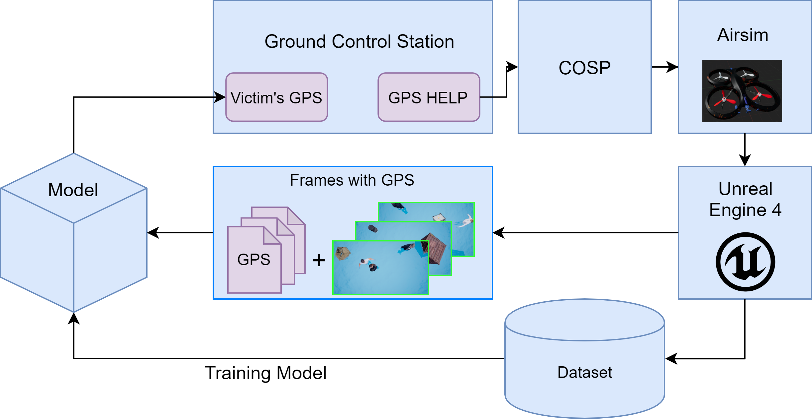
</p>

## 2. Setup 
Install [Airsim](https://microsoft.github.io/AirSim/build_windows/) and [Unreal Engine 4.18](https://www.unrealengine.com/en-US/).
Install [CUDA 10.0.130](https://developer.nvidia.com/cuda-10.0-download-archive) and [cuDNN 7.6.5](https://developer.nvidia.com/rdp/cudnn-archive)
Install the required libraries:

    pip install airsim
    pip install tensorflow-gpu==1.14.0
    pip install opencv-python
    pip install numpy==1.16.0
    pip install matplotlib
    pip install pandas==1.0.3
    conda install -c anaconda cudnn=7.6.5
    conda install -c anaconda cudatoolkit=10.0.130

We provide a configuration file for the UAV [settings.json](https://drive.google.com/file/d/1COC-uGJZrwiN0prTnnxt4UzI9AGvXMMS/view?usp=sharing) move this file to directory: ```C:\Users\This PC\Documents\AirSim``` and [Ocean Environment](https://drive.google.com/file/d/1gyBFdJL_k-0t9gcYjF5lJMKq-Xw_9fD9/view?usp=sharing).

## 3. Data collection
**Step 1:** Start the Unreal Engine and open the project containing the Ocean environment.
<p align="center">
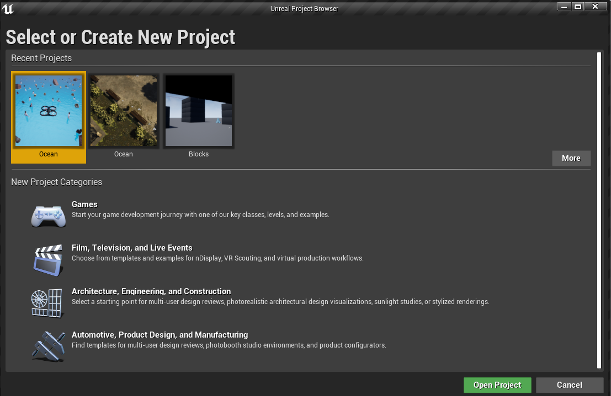
</p>

**Step 2:** Go to the Map folder. Then choose the Ocean environment with the proper settings before starting the flight simulation.
<p align="center">
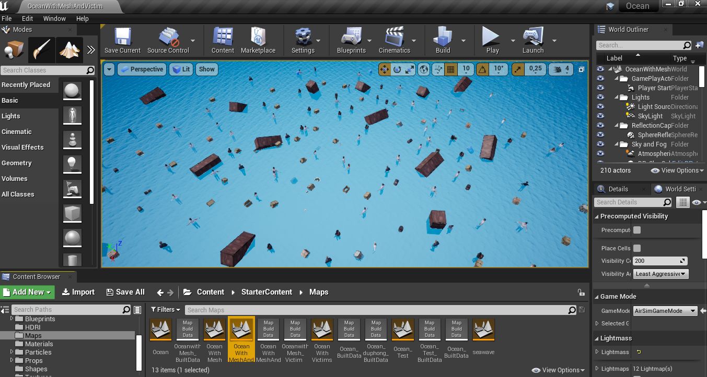
</p>

**Step 3:** Initiate flight by dropping the UAV into the simulation environment. Click Play on Unreal Engine to do this.
<p align="center">
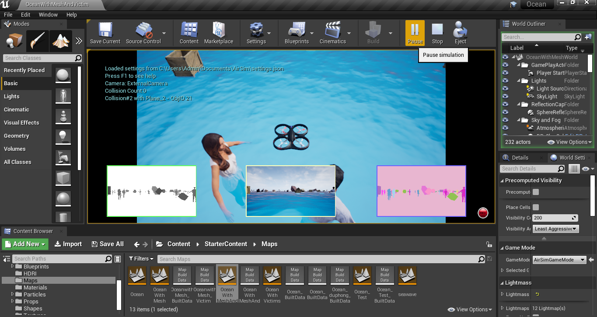
</p>

**Step 4:** Open Visual Studio Code and open to the directory containing the Python script source code.

<p align="center">
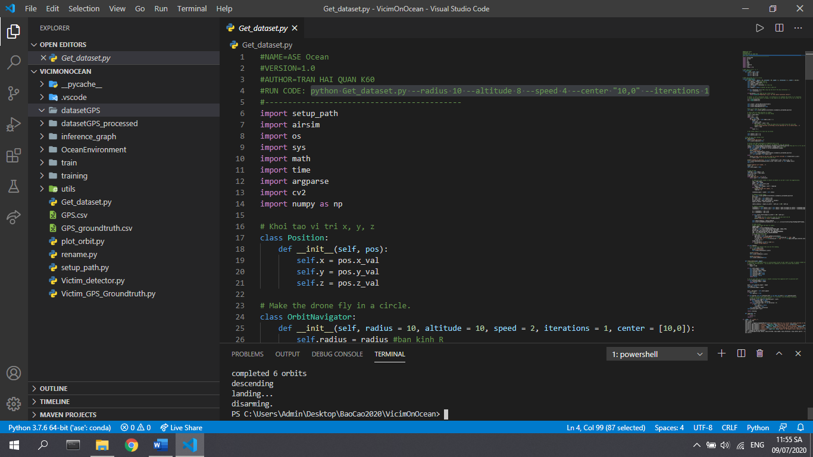
</p>

    python Get_Dataset.py --radius 10 --altitude 8 --speed 4 --center "10,0" --iterations 1

The parameters to set are:
- radius (m): Additional radius for the UAV after each round orbit is completed.
- altitude (m): UAV flight altitude.
- speed (m/s): UAV flight speed.
- center (NED): It is the center of the search area where the UAV carries orbit around this center to search for victims.
- interations (int): The number of circular orbits that the UAV will fly.

The table below illustrates the number of images obtained by interation.

|       Radius    |   Altitude | Speed |  Center |  Interation | Images |
| ------ | ------ | ------  | ------ | ------ | ------ |
| 5 | 8 | 4 | (10,0) | 1 | 23 |
| 5 | 8 | 4 | (10,0) | 2 | 53 |
| 5 | 8 | 4 | (10,0) | 3 | 87 |
| 5 | 8 | 4 | (10,0) | 4 | 154 |
| 5 | 8 | 4 | (10,0) | 5 | 189 |
| 5 | 8 | 4 | (10,0) | 6 | 253 |

**Step 5:** Configure flight parameters for UAVs in the command. For each environment, this command parameter will be customized to get different number of images.

<p align="center">
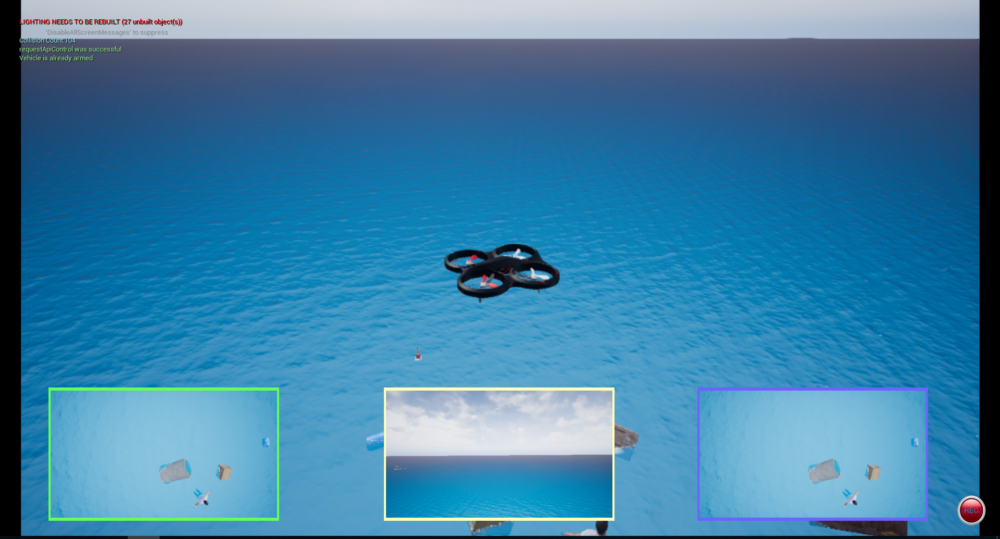
</p>
Several images were obtained from the simulation environment.
<table border="0">
<tr>
    <td>
    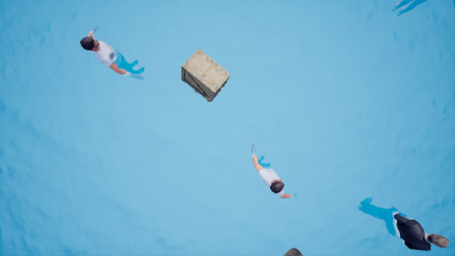
    </td>
    <td>
    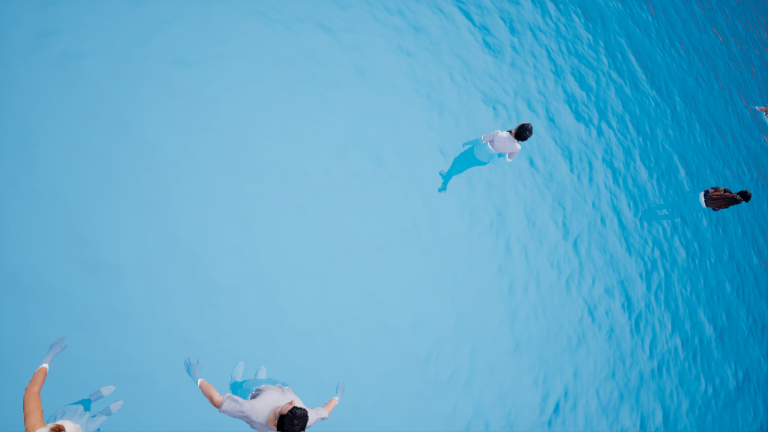
    </td>
    <td>
    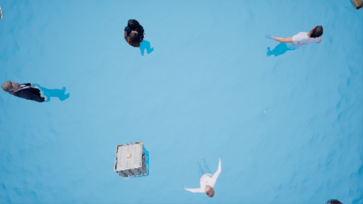
    </td>
</tr>
</table>

Our data set collects itself as [Victims on Ocean](https://drive.google.com/file/d/165Qvrr4CbP1ljeN5H9desV0woZTRdr-c/view?usp=sharing). You can use this to train a victim detection model for yourself.

<p align="center">

</p>

## 4. Training Victims Detector
To train a model to detect victims in simulated ocean environment, you can follow this guide [English](https://github.com/EdjeElectronics/TensorFlow-Object-Detection-API-Tutorial-Train-Multiple-Objects-Windows-10) or [Vietnamese](https://github.com/winter2897/TensorFlow-Object-Detection-API-Tutorial-Train-Multiple-Objects-Windows-10/blob/master/translate/README_Vietnamese.md).

<p align="center">
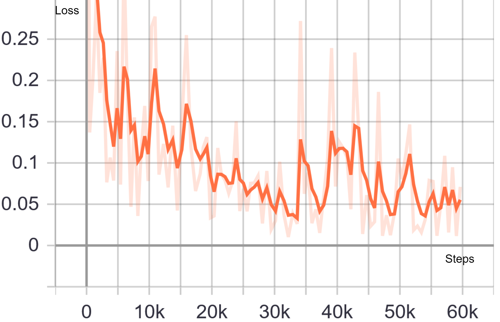
</p>

## 5. Victims Detection
To detect the victim at sea, run the following command:

    python Victim_detector.py
<p align="center">
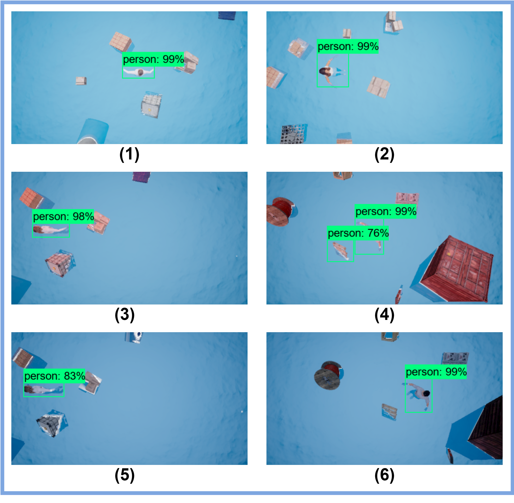
</p>